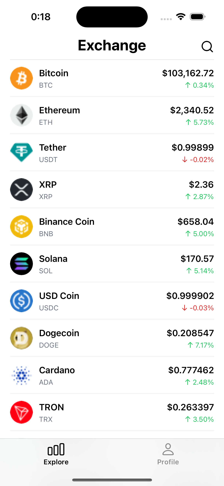

# Crypto Exchange App

A React Native application for tracking cryptocurrency prices, market stats, and trading information.

<p align="center">
    
</p>

## Features

- Real-time cryptocurrency price tracking
- Detailed market statistics and price history
- Support for multiple popular cryptocurrencies (Bitcoin, Ethereum, and more)
- User profiles and preferences

## Getting Started

> **Note**: Make sure you have completed the [React Native Environment Setup](https://reactnative.dev/docs/environment-setup) before proceeding.

### Prerequisites

- Node.js
- Yarn
- Xcode (for iOS development)
- Android Studio (for Android development)

### Installation

1. Clone the repository
2. Install dependencies:

```sh
yarn
```

3. For iOS, install CocoaPods dependencies:

```sh
npx pod-install
```

## Development

### Running the App

```sh
# Start Metro bundler
yarn start

# Run on iOS
yarn ios

# Run on Android
yarn android
```

### Development Tools

```sh
# Type checking
yarn compile

# Lint code
yarn lint

# Open iOS project in Xcode
yarn xcode
```

### Configuration

If needed, modify the app configuration in `src/config/index.ts` to adjust API endpoints, default settings, or other environment-specific variables.

## Screenshots

### Exchange List


### Coin Details


### User Profile


## Troubleshooting

If you encounter issues:

- Make sure all dependencies are installed correctly
- Verify that your environment is set up properly for React Native development
- Check the Metro bundler console for error messages
- For iOS-specific issues, try cleaning the build folder: `cd ios && rm -rf build/ && cd ..`
- For Android-specific issues, try cleaning the Gradle cache: `cd android && ./gradlew clean && cd ..`

## Learn More

To learn more about the technologies used in this project:

- [React Native Documentation](https://reactnative.dev/docs/getting-started)
- [TypeScript Documentation](https://www.typescriptlang.org/docs/)
- [React Navigation](https://reactnavigation.org/docs/getting-started)
